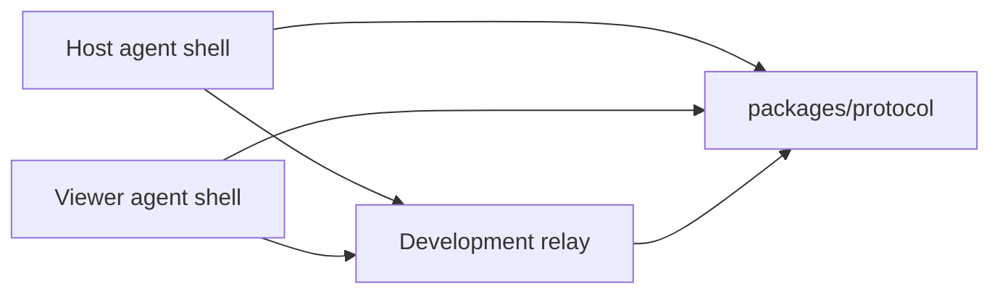

# Architecture

## Bootstrap Architecture

The bootstrap validates the session protocol and relay behavior before native Windows code exists.

## Components

### packages/protocol

Owns shared schemas for:

- Peer roles.
- Session join messages.
- Consent decisions.
- Permission grants.
- Relay signaling.
- Session control.
- Audit events.

The protocol package is the compatibility contract between host, viewer, relay, and future native adapters.

### apps/relay

Provides a development WebSocket relay:

- Accepts host/viewer peers.
- Requires session id, peer id, role, and pairing credential.
- Optionally enforces a shared development token.
- Limits a room to one host and one viewer.
- Validates protocol envelopes before forwarding.

This relay is not production authorization. A future identity/auth OpenSpec change must add proper accounts, token lifecycle, device trust, and audit persistence.

### apps/agent-shell

Provides a CLI exerciser for protocol and relay behavior. It intentionally does not capture screens, inject input, sync clipboard, transfer files, or install a service.

## Future Windows Architecture

Future native work should be split into separate OpenSpec changes:

- Host UI and session indicator.
- Viewer UI.
- Windows screen capture adapter.
- Windows input adapter.
- WebRTC media transport.
- Identity and device pairing.
- Audit persistence.
- Installer and update model.

Native code must preserve host-visible consent and revocation controls.
